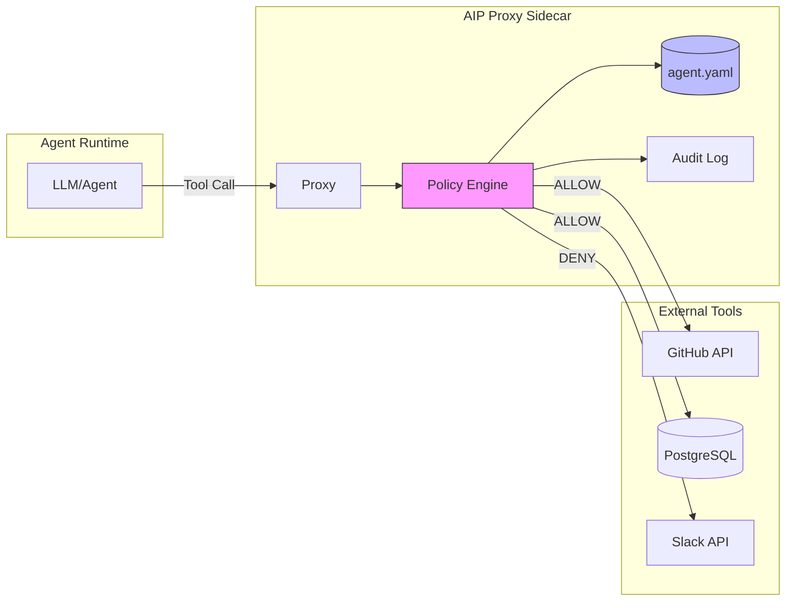

# Agent Identity Protocol (AIP)

**The Zero-Trust Identity Layer for Autonomous Agents**

[](LICENSE)
[]()

---

## The Problem: God Mode by Default

Modern AI agents operate with **unrestricted access** to powerful tools. When you grant an LLM access to your GitHub account, database, or cloud infrastructure, you're not just giving it an API key—you're granting **unbounded intent execution** with no policy layer.

### The Threat Model

| Threat | Description | Real-World Example |
|--------|-------------|-------------------|
| **Indirect Prompt Injection** | Malicious instructions embedded in data the agent processes | *GeminiJack* (2024): Attackers embedded prompts in Google Docs that hijacked Gemini's actions |
| **Consent Fatigue** | Users approve broad permissions without understanding scope | "Allow GitHub access" grants `repo:delete`, not just `repo:read` |
| **Shadow AI** | Agents operating outside enterprise security boundaries | Developers running local Copilot instances with production credentials |
| **Privilege Escalation** | Agents accumulating permissions across tool calls | Agent chains: Slack → Calendar → Email → sends unauthorized messages |
| **Data Exfiltration** | Sensitive data leaving through unmonitored egress | Agent "summarizing" code by posting to external APIs |

### API Keys Are for Code. AIP Is for Intent.

Traditional security assumes **deterministic code execution**. API keys authenticate the *application*. But LLMs are non-deterministic systems executing *user intent* through *model interpretation*.

```
Traditional: Code → API Key → Resource
    └── Deterministic, auditable, predictable

Agent World: User Intent → LLM Interpretation → Tool Call → Resource
    └── Non-deterministic, opaque, emergent behavior
```

**We need a security primitive that authenticates and authorizes *intent*, not just identity.**

---

## The Solution: Manifest-Driven Security Layer

AIP introduces a **policy enforcement proxy** that sits between your agent and the outside world. Every tool call is validated against a declarative manifest before execution.

```
┌─────────────────────────────────────────────────────────────────────────────┐
│                          TRUST BOUNDARY                                      │
│  ┌──────────┐    ┌─────────────────┐    ┌──────────────┐    ┌────────────┐ │
│  │          │    │                 │    │              │    │            │ │
│  │  Agent   │───▶│   AIP Proxy     │───▶│ Policy Check │───▶│ Real Tool  │ │
│  │  (LLM)   │    │   (Sidecar)     │    │ (agent.yaml) │    │ (GitHub)   │ │
│  │          │◀───│                 │◀───│              │◀───│            │ │
│  └──────────┘    └─────────────────┘    └──────────────┘    └────────────┘ │
│                         │                      │                            │
│                         ▼                      ▼                            │
│                  ┌─────────────┐       ┌──────────────┐                    │
│                  │ Audit Log   │       │ Identity     │                    │
│                  │ (immutable) │       │ Federation   │                    │
│                  └─────────────┘       └──────────────┘                    │
└─────────────────────────────────────────────────────────────────────────────┘
```



---

## Core Concepts

### 1. The Manifest (`agent.yaml`)

Every agent declares its **capabilities and constraints** in a manifest. This is the single source of truth for what an agent *should* be able to do.

```yaml
# agent.yaml - Declarative policy for a code review agent
apiVersion: aip.io/v1alpha1
kind: AgentManifest
metadata:
  name: code-review-agent
  version: 1.0.0
  owner: platform-team@company.com

spec:
  # Identity assertion method
  identity:
    provider: oidc
    issuer: https://auth.company.com
    audience: aip-proxy
    
  # Capability declarations (what the agent CAN request)
  capabilities:
    - name: github
      operations:
        - action: repos.get
          scope: "org:mycompany/*"
        - action: pulls.list
          scope: "org:mycompany/*"
        - action: pulls.createReview
          scope: "org:mycompany/*"
          constraints:
            event: ["COMMENT", "APPROVE"]  # Cannot REQUEST_CHANGES
        # Explicitly DENY destructive operations
        - action: repos.delete
          effect: deny
        - action: git.push
          effect: deny
          
    - name: postgres
      operations:
        - action: query
          constraints:
            tables: ["pull_requests", "reviews"]
            operations: ["SELECT"]  # Read-only
            
  # Egress filtering
  egress:
    allowlist:
      - "api.github.com"
      - "postgres.internal.company.com:5432"
    denylist:
      - "*"  # Default deny all other egress
      
  # Rate limiting
  limits:
    requests_per_minute: 100
    max_tokens_per_request: 4096
    
  # Session constraints
  session:
    max_duration: 1h
    require_human_approval:
      - pattern: "*.delete"
      - pattern: "*.push"
```

### 2. Identity Federation

AIP replaces **static, long-lived API keys** with **short-lived, scoped identity assertions**.

| Traditional | AIP |
|------------|-----|
| API key embedded in agent code | OIDC token issued per session |
| Key valid indefinitely | Token expires in minutes |
| Full API access | Scoped to manifest capabilities |
| Shared across environments | Unique per agent instance |
| Revocation = rotate everywhere | Revocation = deny at proxy |

**Identity Chain:**

```
Human User (authenticated)
    └─▶ Spawns Agent Session (scoped)
            └─▶ Agent receives short-lived AIP token
                    └─▶ Token encodes: user_id, agent_id, manifest_hash, exp
                            └─▶ Proxy validates token + manifest on every call
```

### 3. Egress Filtering & Data Loss Prevention

Agents should only communicate with **declared endpoints**. AIP enforces network-level egress controls:

```yaml
egress:
  allowlist:
    - "api.github.com"           # Explicit GitHub access
    - "*.internal.company.com"   # Internal services only
  denylist:
    - "pastebin.com"             # Known exfil targets
    - "*.ngrok.io"
    - "*"                        # Default deny
    
  # Content inspection
  dlp:
    block_patterns:
      - "(?i)api[_-]?key"
      - "(?i)secret"
      - "-----BEGIN .* PRIVATE KEY-----"
```

### 4. Audit & Observability

Every tool call is logged with full context for forensic analysis:

```json
{
  "timestamp": "2026-01-20T14:32:01Z",
  "session_id": "aip-session-7f3d2a1b",
  "agent_id": "code-review-agent",
  "user_id": "alice@company.com",
  "tool_call": {
    "tool": "github",
    "action": "pulls.createReview",
    "parameters": {
      "owner": "mycompany",
      "repo": "backend",
      "pull_number": 1234,
      "event": "APPROVE"
    }
  },
  "policy_decision": "ALLOW",
  "manifest_version": "1.0.0",
  "manifest_hash": "sha256:a1b2c3...",
  "latency_ms": 45
}
```

---

## Security Comparison

| Aspect | Standard MCP | AIP-Enabled MCP |
|--------|--------------|-----------------|
| **Authentication** | Static API keys | Short-lived OIDC tokens |
| **Authorization** | None (full access) | Per-action policy check |
| **Scope** | Implicit (whatever key allows) | Explicit manifest declaration |
| **Audit** | Application logs (if any) | Immutable, structured audit trail |
| **Egress Control** | None | Network-level filtering |
| **Revocation** | Rotate API keys | Instant token/session revocation |
| **Human-in-the-Loop** | Not supported | Configurable approval gates |
| **Blast Radius** | Unlimited | Scoped to manifest |
| **Compliance** | Manual attestation | Policy-as-code, auditable |

---

## Architecture Principles

1. **Defense in Depth**: Multiple independent security layers (identity, policy, egress, audit)
2. **Least Privilege by Default**: Agents start with zero capabilities; everything is opt-in
3. **Fail Closed**: Unknown actions are denied; network errors = deny
4. **Immutable Audit**: All decisions logged; logs cannot be modified by agents
5. **Human Sovereignty**: Critical actions require human approval
6. **Manifest Portability**: Same manifest works across runtimes (local, Kubernetes, serverless)

---

## Roadmap

- [x] **Specification v0.1**: Core manifest schema and policy semantics
- [ ] **v0.1: Local Proxy** — Single-binary proxy for local development
- [ ] **v0.2: Kubernetes Sidecar** — Inject AIP as a sidecar container
- [ ] **v0.3: MCP Integration** — Native MCP transport with AIP policy layer
- [ ] **v0.4: Multi-Agent Support** — Agent-to-agent authentication and delegation
- [ ] **v1.0: OIDC Federation** — Full identity provider integration (Okta, Auth0, Google)
- [ ] **v1.1: Policy Language** — Rego/CEL support for complex authorization rules
- [ ] **v1.2: Observability Stack** — Prometheus metrics, OpenTelemetry traces

---

## Project Structure

```
agent-identity-protocol/
├── spec/                    # Protocol specification (RFC-style)
│   ├── aip-spec.md
│   └── manifest-schema.json
├── proxy/                   # Go implementation of AIP proxy
│   ├── cmd/
│   ├── pkg/
│   └── go.mod
├── sdk/                     # Client SDKs
│   ├── python/
│   └── typescript/
├── examples/                # Reference implementations
│   ├── code-review-agent/
│   └── data-analyst-agent/
├── deploy/                  # Deployment configurations
│   ├── kubernetes/
│   └── docker-compose.yaml
└── docs/                    # Extended documentation
```

---

## Getting Started

*Coming soon in v0.1*

```bash
# Install the AIP proxy
go install github.com/ArangoGutierrez/agent-identity-protocol/proxy/cmd/aip-proxy@latest

# Initialize a manifest for your agent
aip-proxy init --name my-agent > agent.yaml

# Run the proxy (intercepts MCP traffic)
aip-proxy serve --manifest agent.yaml --listen :8080

# Point your agent at the proxy
export MCP_ENDPOINT=http://localhost:8080
```

---

## Contributing

AIP is an open specification. We welcome contributions from:

- **Security researchers**: Threat modeling, attack surface analysis
- **Platform engineers**: Kubernetes operators, cloud integrations  
- **AI/ML engineers**: Agent framework integrations
- **Compliance teams**: Regulatory mapping (SOC2, GDPR, HIPAA)

See [CONTRIBUTING.md](CONTRIBUTING.md) for guidelines.

---

## Prior Art & Inspiration

AIP builds on established security patterns:

- **[SPIFFE/SPIRE](https://spiffe.io/)**: Workload identity framework — AIP extends this to agent identity
- **[Open Policy Agent](https://www.openpolicyagent.org/)**: Policy-as-code — AIP's policy engine draws from OPA's design
- **[Istio](https://istio.io/)**: Service mesh authorization — AIP applies mesh principles to agent traffic
- **[AWS IAM](https://aws.amazon.com/iam/)**: Fine-grained permissions — AIP manifests are IAM policies for agents
- **[OAuth 2.0 / OIDC](https://openid.net/connect/)**: Token-based identity — AIP leverages OIDC for federation

---

## License

Apache License 2.0 — See [LICENSE](LICENSE) for details.

Enterprise-friendly with patent grants. Use it, fork it, build on it.

---

## Contact

- **GitHub Issues**: Bug reports, feature requests
- **Discussions**: Architecture questions, use case exploration
- **Security**: arangogutierrez@gmail.com (for responsible disclosure)

---

<p align="center">
  <em>"Trust, but verify—automatically, at every tool call."</em>
</p>
